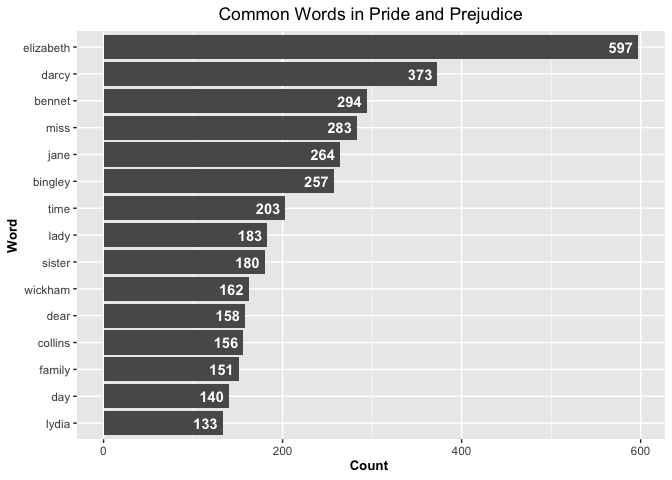

Assignment-B4
================
Han Wang
2023-12-06

# Option A – Strings and functional programming in R

1.  Load the required packages.

``` r
library(stringr)
library(purrr)
library(janeaustenr)
library(tidytext)
library(tidyverse)
```

    ## ── Attaching core tidyverse packages ──────────────────────── tidyverse 2.0.0 ──
    ## ✔ dplyr     1.1.4     ✔ readr     2.1.4
    ## ✔ forcats   1.0.0     ✔ tibble    3.2.1
    ## ✔ ggplot2   3.4.4     ✔ tidyr     1.3.0
    ## ✔ lubridate 1.9.3     
    ## ── Conflicts ────────────────────────────────────────── tidyverse_conflicts() ──
    ## ✖ dplyr::filter() masks stats::filter()
    ## ✖ dplyr::lag()    masks stats::lag()
    ## ℹ Use the conflicted package (<http://conflicted.r-lib.org/>) to force all conflicts to become errors

``` r
library(palmerpenguins)
library(testthat)
```

    ## 
    ## Attaching package: 'testthat'
    ## 
    ## The following object is masked from 'package:dplyr':
    ## 
    ##     matches
    ## 
    ## The following objects are masked from 'package:readr':
    ## 
    ##     edition_get, local_edition
    ## 
    ## The following object is masked from 'package:tidyr':
    ## 
    ##     matches
    ## 
    ## The following object is masked from 'package:purrr':
    ## 
    ##     is_null

## Exercise 1

Take a Jane Austen book contained in the janeaustenr package, or another
book from some other source, such as one of the many freely available
books from Project Gutenberg (be sure to indicate where you got the book
from). Make a plot of the most common words in the book, removing “stop
words” of your choosing (words like “the”, “a”, etc.) or stopwords from
a pre-defined source, like the stopwords package or
tidytext::stop_words.

### Take Pride and Prejudice from the janeaustenr package

``` r
book <- tibble(Text = janeaustenr::prideprejudice)
words <- book %>% unnest_tokens(output = word, input = Text) 
## removing all stopwords of the words in Pride and Prejudice using the function anti_join()
wordcounts <- words %>% anti_join(tidytext::stop_words) %>% count(word, sort = TRUE)
```

    ## Joining with `by = join_by(word)`

``` r
head(wordcounts)
```

    ## # A tibble: 6 × 2
    ##   word          n
    ##   <chr>     <int>
    ## 1 elizabeth   597
    ## 2 darcy       373
    ## 3 bennet      294
    ## 4 miss        283
    ## 5 jane        264
    ## 6 bingley     257

``` r
## find the most common words (top 15) in the Pride and Prejudice
top_15 <- wordcounts %>% arrange(desc(n)) %>% head(15)
head(top_15)
```

    ## # A tibble: 6 × 2
    ##   word          n
    ##   <chr>     <int>
    ## 1 elizabeth   597
    ## 2 darcy       373
    ## 3 bennet      294
    ## 4 miss        283
    ## 5 jane        264
    ## 6 bingley     257

``` r
## Plot the most common words (top 15) in a bar graph of counts
top_15 %>% 
    ggplot(aes(reorder(word,n), n)) + geom_col() + coord_flip() +
    labs(x = "Word", y = "Count ", title = "Common Words in Pride and Prejudice") +
    geom_text(aes(label = n), hjust = 1.2, colour = "white", fontface = "bold") +
    theme(plot.title = element_text(hjust = 0.5), 
        axis.title.x = element_text(face="bold", size = 10),
        axis.title.y = element_text(face="bold", size = 10))
```

<!-- -->

## Exercise 2

Make a function that converts words to your own version of Pig Latin.

The specific input and output that you decide upon is up to you. Don’t
forget to implement good function-making hygiene: we’ll be looking for
(unrendered) roxygen2-style documentation (being sure to describe your
Pig Latin conversion), examples of applying the function, 3
non-redundant tests, appropriate use of arguments, and appropriate
amount of checking for proper input.

Your Pig Latin should incorporate two components: Rearrangement
component & Addition component

``` r
#' Translate word to Han Wang's version of Pig Latin
#'
#' The pig latin list consists of both lower case and upper case h, a, and n 
#' 
#' The rearrangement and addition rules of my version of pig latin are as the following:
#' 
#' 1. Rearrangement: Locate the first occurrence of one Han Letter. Starting from this point, then we extract the segment extending to the word's end. Finally we reverse this extracted segment and prepend it to the beginning of the word, effectively repositioning it.
#' 
#' 2. Addition: Append the word "HAN" to the end of the reversed segment. 
#'
#' @param word A character string to be translated
#'
#' @return A character string in my Han Latin format

convert <- function(word) {
  stopifnot(is.character(word))
  
  han <- c("h", "a", "n", "H", "A", "N")
  letters <- str_split(word, "")[[1]]
  
  # Find the first occurrence of the Han letter
  han_positions <- which(letters %in% han)
  
  if (length(han_positions) == 0) {
    # If no Han letter is found, return the word with 'HAN' appended
    return(paste0(word, "HAN"))
  } else {
    # If a Han letter is found, perform the rearrangement and addition
    first_han <- min(han_positions)
    rest_part <- substr(word, first_han, nchar(word))
    splits <- strsplit(rest_part, "")[[1]]
    reversed <- rev(splits)
    reversed_part <- paste(reversed, collapse = "")
    new_word <- paste0(reversed_part, "HAN", substr(word, 1, first_han - 1))
    return(new_word)
  }
}
```

``` r
# try to run our han Latin using the following examples 
convert("Glitz") # no Han Letter
```

    ## [1] "GlitzHAN"

``` r
convert("happy") # first Han Letter is a
```

    ## [1] "yppahHAN"

``` r
convert("Hello") # first Han Letter is h
```

    ## [1] "olleHHAN"

``` r
# Test the function
test_that("Test0", {
  # throw error when the input is not valid
  expect_error(convert(123))
  expect_error(convert(list()))
})
```

    ## Test passed 😀

``` r
test_that("Test1", {
  expect_equal(convert("Glitz"), "GlitzHAN")
})
```

    ## Test passed 😸

``` r
test_that("Test2", {
  expect_equal(convert("happy"), "yppahHAN")
})
```

    ## Test passed 🎊

``` r
test_that("Test3", {
  expect_equal(convert("HAN"), "NAHHAN")
})
```

    ## Test passed 🎊
